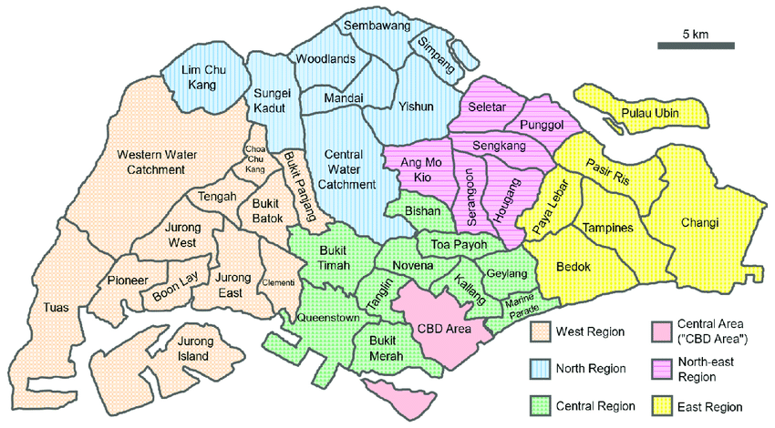

# Ride Aunty Telegram Bot 🚕🤖

**RideAuntyTelegramBot** is a predictive price comparison bot for ride-hailing services in Singapore. It leverages machine learning models to estimate ride fares for different ride-hailing apps based on user input, such as origin, destination, and time of travel. Integrated with Telegram, the bot provides users with an intuitive interface for comparing prices and making informed transportation choices.

---

## Problem Statement

The challenge involves developing a ride-hailing price prediction system to help users compare prices across different ride-hailing applications in Singapore. It aims to predict ride fares accurately based on factors like:
- Origin and destination regions
- Time of the day
- Specific ride-hailing applications

---

## Objective

The goal is to build a robust predictive model that estimates ride fares for popular ride-hailing apps (TADA, Gojek, and Zig) to provide users with insights into pricing dynamics and empower better decision-making.

---

## Dataset

The dataset was obtained from a Reddit post: [Ride-hailing data from r/singapore](https://www.reddit.com/r/singapore/comments/18wpk37/i_collected_60868_price_points_from_3_popular/). It includes 60,868 data points with information from TADA, Gojek, and Zig.

### Key Insights:
- **TADA** is the most economical option overall.
- **Gojek** shows moderate variability in pricing.
- **Zig** has the highest fare variability, with ~60% of queries triggering surge pricing.



---

## Methodology

1. **Data Generation**:
   - Synthetic ride data created using Python scripts.
   - Attributes include regions, ride-hailing apps, times of the day, base costs, and surge indicators.

2. **Predictive Modeling**:
   - Gradient Boosting Regressors were trained for each ride-hailing app.
   - Input variables: `From Region`, `Destination Region`, `Time of Day`.
   - Evaluated using Root Mean Squared Error (RMSE).

3. **Telegram Bot Integration**:
   - The bot collects user inputs (current address, destination, time of day) and provides price predictions for TADA, Gojek, and Zig.
   - Users can reset the conversation at any point using the `/reset` command.

---

## Features

- **Compare Prices**: Get price estimates for TADA, Gojek, and Zig.
- **User-Friendly Interface**: Simple interaction via Telegram commands.
- **Custom Predictions**: Input origin, destination, and time to receive personalized price comparisons.

---

## Screenshots

### Ride Aunty Icon


---

## Usage

1. **Install Dependencies**:
   ```bash
   pip install -r requirements.txt
   ```
2. **Run the Telegram Bot:**:
   ```bash
   python RideAuntyTelegramBot.py
   ```

3. **Access the Bot: Start chatting with the bot via Ride Aunty Telegram Bot.**

## Challenges & Limitations
- The bot is limited to three ride-hailing platforms (TADA, Gojek, Zig).
- Predictions are based on region-to-region travel and time of day; full address predictions are not supported.
- Data accuracy is constrained by publicly available datasets.

## How It Works
1. User sends /start to begin the conversation.
2. The bot prompts for:
   * Current location
   * Destination
   * Time of travel
3. Predictions are provided for each platform based on trained models.

## Contribution
Contributions are welcome! Feel free to submit issues or pull requests to improve the bot.

## License
This project is open-source and licensed under the MIT License.

## Acknowledgments
1. Dataset: Reddit r/singapore post
2. Libraries: python-telegram-bot, pandas, scikit-learn


### Instructions:
- Save the above content as `README.md` in the root of your project.
- Ensure the uploaded images (`ride_aunty.png` and `URA_Region2.png`) are in the root or specify their correct paths in the markdown.

Let me know if you need further adjustments!

